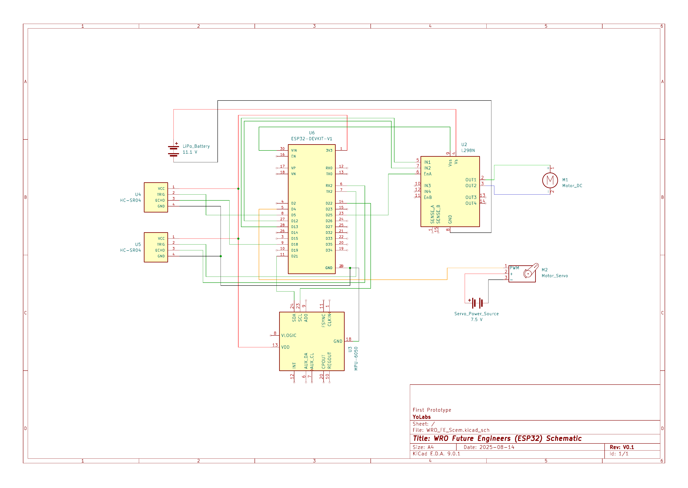

# Schematics

This folder contains the wiring and connection diagrams for the **WRO Future Engineers Reference Build**.

## Files
- **Prototype_Schematics_v01.pdf** – First version of the complete schematic for the prototype build.
- **Prototype_Schematics_v01.png** – Image version of the schematic for quick reference.

## Quick View

## Download / Detailed View
For a high-quality version, open or download the PDF:  
[📄 View Prototype_Schematics_v01.pdf](Prototype_Schematics_v01.pdf)

---

### Version History
- **v01** – Initial prototype schematic, includes wiring for motors, sensors, and controller connections.
