# WRO Future Engineer Vehicle – Source Code Repository

This folder contains the **comprehensive source code** for the WRO Future Engineers 2025 competition, including implementations for both the **Open Challenge Round** and **Obstacle Challenge Round**.  
The codebase supports autonomous navigation with advanced sensor integration, object detection, and multi-platform architecture (ESP32 + Raspberry Pi).

---

## 📂 Repository Structure

| Folder/File | Description |
|-------------|-------------|
| **main.py** | Main entry point script (currently empty - reserved for future integration) |
| **ESP32_Vehicle/** | Complete PlatformIO project for Open Round ESP32 implementation |
| **Open Round/** | Standalone code files for Open Challenge Round |
| **Obstacle Round/** | Master-Slave architecture code for Obstacle Challenge Round |

### 📁 ESP32_Vehicle (Open Round - PlatformIO Project)
- **main.cpp** - Primary autonomous navigation code
- **temp_files/** - Development versions and testing variants
- **platformio.ini** - PlatformIO configuration

### 📁 Open Round (Standalone Files)
- **esp32_code.cpp** - ESP32 implementation for Open Challenge
- **rpi_button_command.py** - Raspberry Pi button interface

### 📁 Obstacle Round (Master-Slave Architecture)
- **rpi_codes (Master)/**
  - `obstacle_detection_with_extra_logging.py` - Computer vision and obstacle detection
  - `region_based_detection.py` - Advanced region-based detection algorithms
- **esp32 code(Slave)/**
  - `serial_receive_and_send_commands.cpp` - ESP32 motor control and sensor interface

---

## ⚙️ Hardware Requirements

### **Open Round Setup**
- **ESP32 Dev Board** (ESP-WROOM-32)
- DC motor with **L298N** motor driver (rear wheel drive)
- Servo motor for steering
- IMU (e.g., MPU6050)
- Ultrasonic sensors (front & right)
- Power supply (Li-ion battery or equivalent)

### **Obstacle Round Setup**
- **Raspberry Pi 4** (Master controller)
- **ESP32 Dev Board** (Slave controller)
- **Camera module** (for computer vision)
- DC motors with motor drivers
- Servo motor for steering
- Ultrasonic sensors
- IMU sensor
- Power supply system
- Serial communication interface

---

## 🚀 How to Use

### **Open Round - Option 1: PlatformIO (Recommended)**
1. Install [PlatformIO IDE](https://platformio.org/) (VS Code extension or standalone).
2. Open the project folder `ESP32_Vehicle` in PlatformIO.
3. Connect your ESP32 board via USB.
4. In `platformio.ini`, confirm your board setting (e.g., `board = esp32dev`).
5. Build & Upload:
   ```bash
   pio run --target upload
   ```
6. Monitor Serial Output:
   ```bash
   pio device monitor
   ```

### **Open Round - Option 2: Arduino IDE**
1. **Install Arduino IDE** (latest version).
2. **Install ESP32 Board Package**:  
   - Go to **File → Preferences → Additional Board Manager URLs**  
   - Add:  
     ```
     https://dl.espressif.com/dl/package_esp32_index.json
     ```
   - Open **Tools → Board Manager** and install **ESP32 by Espressif Systems**.
3. **Install required libraries**:
   - `Wire` (usually pre-installed)
   - Servo control library (`ESP32Servo.h` or similar)
   - IMU library (e.g., `Adafruit MPU6050` or equivalent)
   - Ultrasonic sensor library (e.g., `NewPing` or similar)
4. **Copy the code**: Copy the contents from either `ESP32_Vehicle/src/main.cpp` or `Open Round/esp32_code.cpp` into a new Arduino `.ino` file.
5. **Select your board**: **Tools → Board → ESP32 Arduino → ESP32 Dev Module**
6. **Upload the code** using the Upload button.
7. **Open Serial Monitor** to view debug output.

### **Obstacle Round - Master-Slave Setup**
1. **Raspberry Pi (Master) Setup**:
   - Install Python 3.8+ with OpenCV, NumPy, and pySerial
   - Copy files from `Obstacle Round/rpi_codes (Master)/` to your Raspberry Pi
   - Connect camera module and configure
   - Set up serial communication with ESP32

2. **ESP32 (Slave) Setup**:
   - Use Arduino IDE or PlatformIO to upload `Obstacle Round/esp32 code(Slave)/serial_receive_and_send_commands.cpp`
   - Configure serial communication pins
   - Connect motors, sensors, and actuators

3. **Integration**:
   - Establish serial communication between Raspberry Pi and ESP32
   - Run the Python scripts on Raspberry Pi for computer vision processing
   - ESP32 handles real-time motor control based on commands from Raspberry Pi

---
## 📊 Control Flow

### Open Round - Autonomous Navigation (ESP32)
The following diagram illustrates the decision-making process used by the vehicle during Open Round autonomous operation.

```mermaid
flowchart LR

A[Start] --> B[Wait for Button Press]
B --> C[Setup Hardware & Sensors]
C --> D[Calibrate IMU & Record Start Pos]
D --> E[Main Loop]
E --> F[Update Sensors]
F --> G[Log Data]
G --> H{Returning to Start?}
H -- Yes --> I{At Start Pos?}
I -- Yes --> J[Stop & End]
I -- No --> K[Navigate]
H -- No --> K
K --> L[Check Lap Completion]
L --> M{Front < 25cm?}
M -- Yes --> N[Move Backward]
M -- No --> O{Front < 75 & Right > 90?}
O -- Yes --> P[Right Turn 90°]
P --> Q[Forward 300ms]
Q --> F
O -- No --> R{Front < 70 & Right < 75?}
R -- Yes --> S[Left Turn 133°]
S --> Q
R -- No --> T{Right > 90?}
T -- Yes --> U[Straight Forward]
T -- No --> V[Default Forward]
U --> F
V --> F
```



### Obstacle Round - Master-Slave Architecture
The Obstacle Round uses a more sophisticated approach with computer vision processing on Raspberry Pi and real-time control on ESP32:


**Master (Raspberry Pi) Responsibilities:**
- Real-time camera processing
- Obstacle detection and classification
- Path planning algorithms
- High-level decision making

**Slave (ESP32) Responsibilities:**
- Motor control and steering
- Sensor data collection
- Real-time response execution
- Status reporting back to master
---

## 📌 Implementation Notes

### **Open Round**
- Multiple implementation options: PlatformIO project (`ESP32_Vehicle/`) and standalone Arduino code (`Open Round/esp32_code.cpp`)
- `ESP32_Vehicle/temp_files/` contains alternative navigation logic for specific testing scenarios
- Servo angles and motor speeds should be calibrated before running on the full challenge track

### **Obstacle Round** 
- Uses Master-Slave architecture for better performance and modularity
- Computer vision processing is handled by Raspberry Pi for complex obstacle detection
- ESP32 focuses on real-time motor control and sensor integration
- Serial communication enables seamless coordination between both controllers

### **General**
- Ensure GPIO pin assignments in code match your actual hardware wiring
- All sensor calibration should be performed in a controlled environment first
- `main.py` at root level is reserved for future integration features

## 🔧 Development Versions
- **Open Round**: v01 - Initial autonomous navigation implementation
- **Obstacle Round**: Advanced computer vision with region-based detection
- **Integration**: Future versions will utilize `main.py` for unified control

📄 For complete wiring diagrams and hardware setup, refer to the `/schematics` folder in the main repository.
