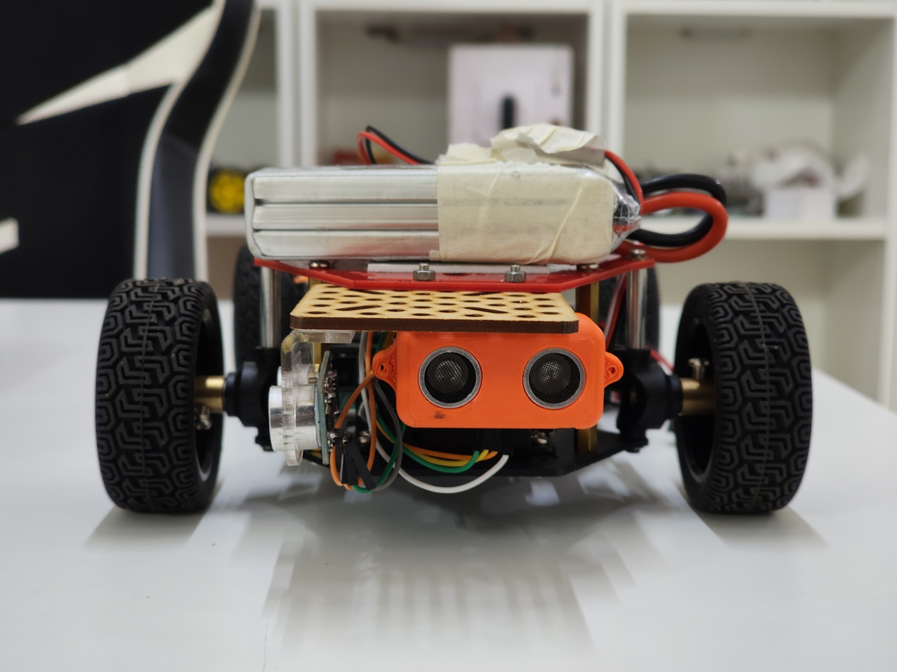
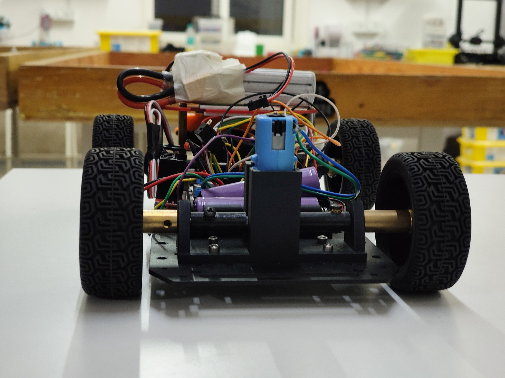
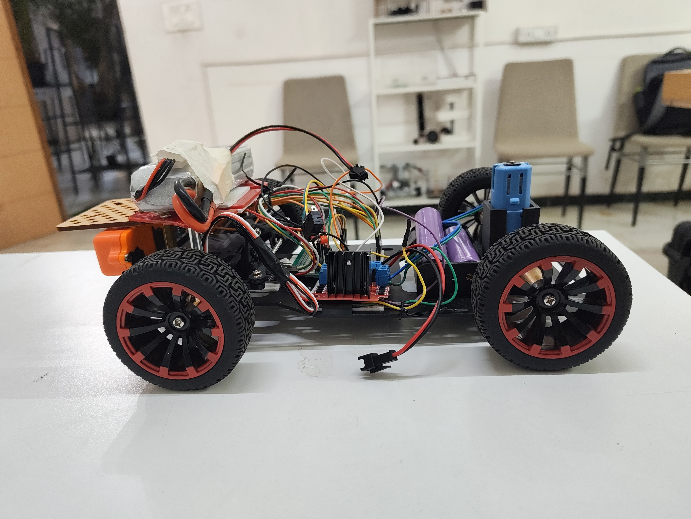
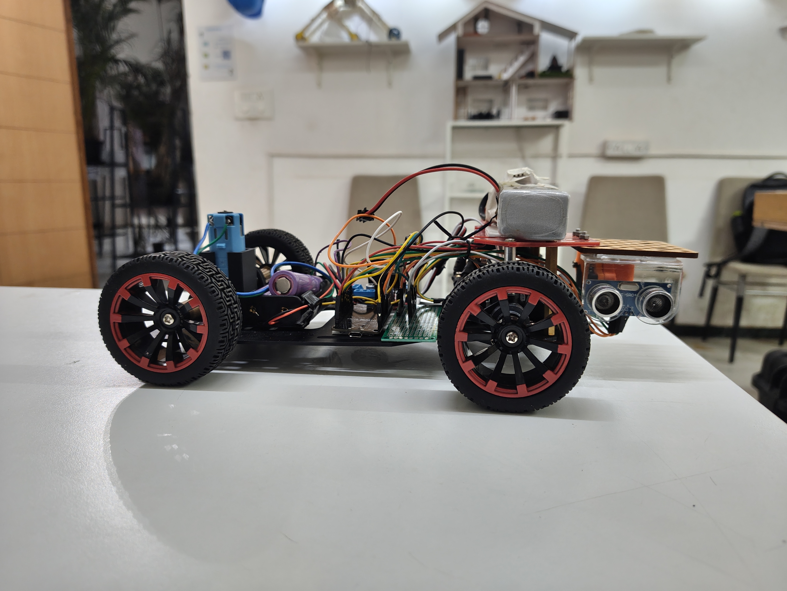
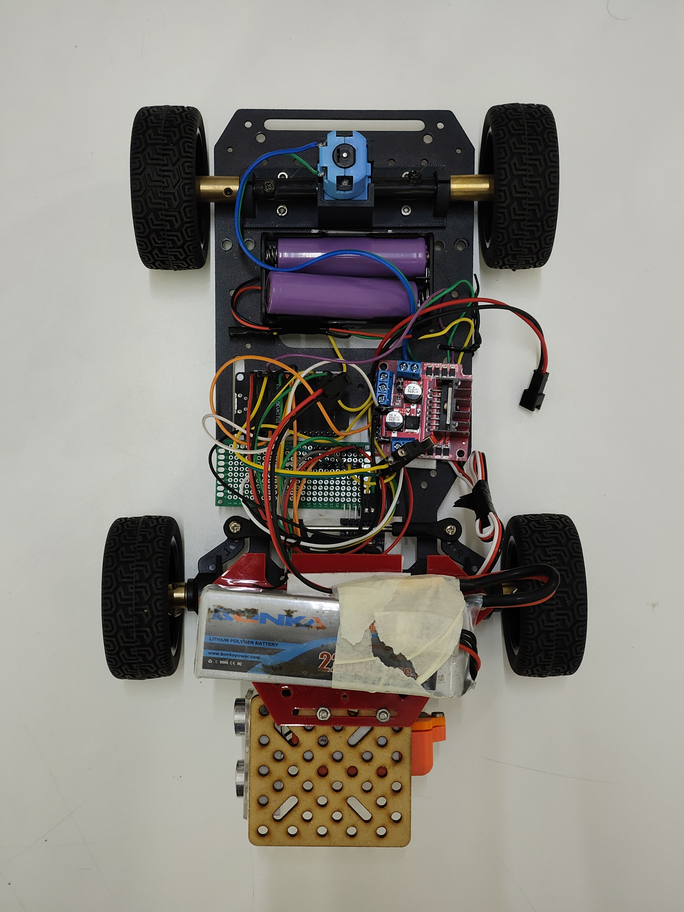

# 🚗 Vehicle Photos

This folder contains **high-quality reference images** of the WRO Future Engineers prototype vehicle from multiple angles.  
These images are useful for documentation, replication, and visual reference during assembly.

---

## 📸 Views

| View        | Image |
|-------------|-------|
| **Front View**  |  |
| **Back View**   |  |
| **Left View**   |  |
| **Right View**  |  |
| **Top View**    |  |

---

### 📂 File List
- `v_front.jpg` – Front-facing view
- `v_back.jpg` – Rear view
- `v_left.jpg` – Left side view
- `v_right.jpg` – Right side view
- `v_top.jpg` – Top-down view

---

> **Tip:** These images can be embedded in reports, presentations, or assembly guides for better clarity.
