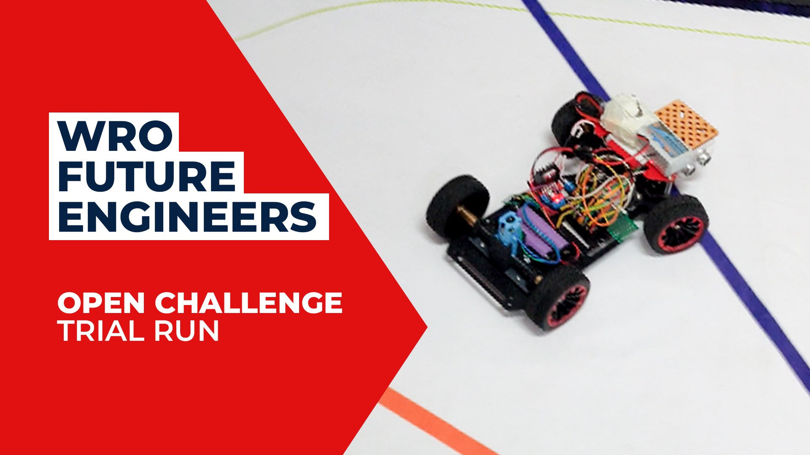
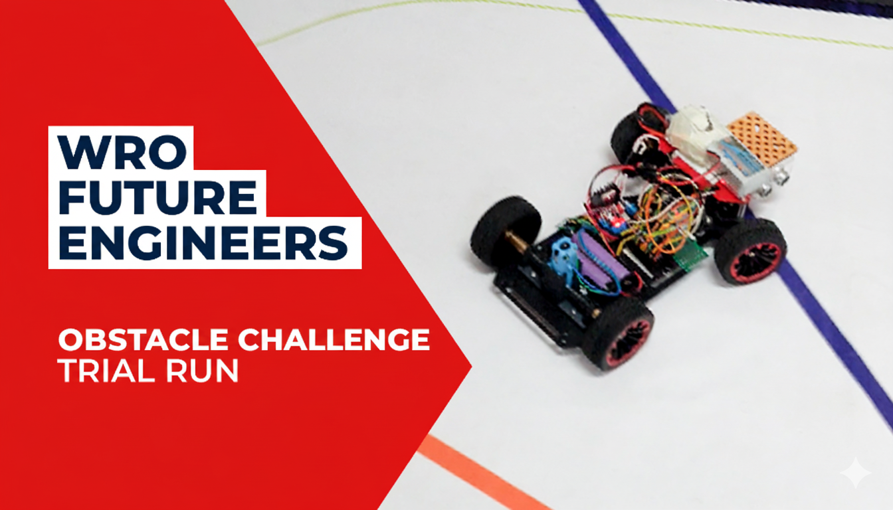

# 📹 WRO Future Engineers Test Run Videos

This folder contains demonstration videos for both competition rounds of the WRO Future Engineers 2025 Reference Vehicle, showcasing autonomous navigation, obstacle detection, and track completion capabilities.

---

## � Competition Round Videos

### **Open Challenge Round**
This video demonstrates the **Open Round** test run with autonomous navigation and sensor-based decision making.

#### 🎯 Open Round Objectives Shown
- Complete lap navigation on the official WRO Future Engineers track
- Smooth steering and speed control using single ESP32 controller
- Ultrasonic sensor-based decision-making for turns and wall following
- IMU-assisted orientation correction
- Precise start and stop at designated points

#### ▶️ Watch Open Round Video

### **Obstacle Challenge Round**
This video showcases the **Obstacle Round** test run with advanced computer vision and Master-Slave architecture.

#### 🎯 Obstacle Round Objectives Shown  
- Advanced obstacle detection and avoidance using computer vision
- Master-Slave coordination between Raspberry Pi and ESP32
- Real-time image processing and decision making
- Dynamic path planning around obstacles
- Complex navigation scenarios with multiple objects

#### ▶️ Watch Obstacle Round Video
  

---

## 📂 Files in This Folder
- **Test_Run_Thumbnail.jpg** – Thumbnail image for Open Round video
- **Obstacle_Challenge_Thumbnail.png** – Thumbnail image for Obstacle Round video  
- **README.md** – This file with video details and links

---

## � Related Documentation
- **Source Code**: `/src/` - Complete implementations for both rounds
- **Wiring Diagrams**: `/schematics/` - Hardware setup for each round
- **Vehicle Photos**: `/vehicle_photos/` - Physical build reference images

---

### 📌 Notes
- **Open Round Video**: Demonstrates single ESP32 controller autonomous navigation
- **Obstacle Round Video**: Shows advanced Master-Slave architecture with computer vision
- **Quality**: For optimal viewing experience, watch in **1080p or higher resolution**
- **Documentation**: These videos serve as official documentation for both competition rounds
- **Architecture Comparison**: Videos clearly show the difference between single and dual-controller approaches
